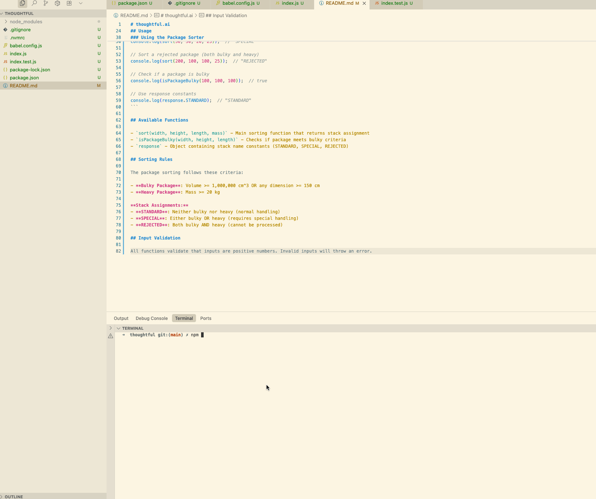

# thoughtful.ai

A package sorting system for Thoughtful's robotic automation factory. This module provides functions to determine which stack packages should be dispatched to based on their volume, dimensions, and mass.

## How It Works



## Features

- Package volume and dimension calculations
- Bulky package detection (volume >= 1,000,000 cm^3 or any dimension >= 150 cm)
- Heavy package detection (mass >= 20 kg)

## Setup

1. **Switch to the correct Node.js version:**
   ```bash
   nvm use
   ```
   This will automatically switch to Node.js v20.19.5 as specified in `.nvmrc`.

2. **Install dependencies:**
   ```bash
   npm install
   ```

## Usage

### Running Tests

- **Run tests once:**
  ```bash
  npm test
  ```

- **Run tests in watch mode:**
  ```bash
  npm run test:watch
  ```

### Using the Package Sorter

```javascript
import { sort, isPackageBulky, response } from './';

// Sort a standard package (small dimensions, light weight)
console.log(sort(50, 30, 20, 10));  // "STANDARD"

// Sort a bulky package (large volume)
console.log(sort(100, 100, 100, 15));  // "SPECIAL"

// Sort a heavy package
console.log(sort(50, 30, 20, 25));  // "SPECIAL"

// Sort a rejected package (both bulky and heavy)
console.log(sort(200, 100, 100, 25));  // "REJECTED"

// Check if a package is bulky
console.log(isPackageBulky(100, 100, 100));  // true

// Use response constants
console.log(response.STANDARD);  // "STANDARD"
```

## Available Functions

- `sort(width, height, length, mass)` - Main sorting function that returns stack assignment
- `isPackageBulky(width, height, length)` - Checks if package meets bulky criteria
- `response` - Object containing stack name constants (STANDARD, SPECIAL, REJECTED)

## Sorting Rules

The package sorting follows these criteria:

- **Bulky Package**: Volume >= 1,000,000 cm^3 OR any dimension >= 150 cm
- **Heavy Package**: Mass >= 20 kg

**Stack Assignments:**
- **STANDARD**: Neither bulky nor heavy (normal handling)
- **SPECIAL**: Either bulky OR heavy (requires special handling)
- **REJECTED**: Both bulky AND heavy (cannot be processed)

## Input Validation

All functions validate that inputs are positive numbers. Invalid inputs will throw an error.